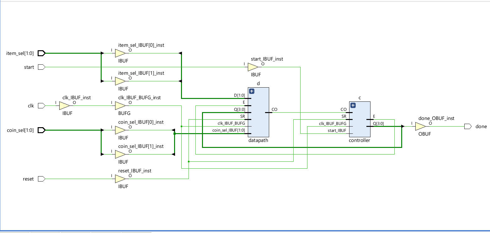

# Vending Machine (Verilog HDL)

A coin-operated vending machine implemented in **Verilog HDL** using a **datapath + FSM-based controller architecture**.  
The design supports item selection, coin insertion, balance update, and item dispensing.

---

##  Project Description
- Datapath performs arithmetic, storage, and comparison operations
- Controller is implemented as a **Finite State Machine (FSM)**
- Design is fully verified using a testbench and waveform simulation
- Design uses parameterized item prices and coin values which can be changed as per requirement.
- Code written in RTL style.

---

##  FSM States (Controller)

| State | Description |
|------|------------|
| **IDLE** | System reset state, waits for start signal |
| **ITEM_SELECT** | Loads selected item into item register |
| **COIN_ACCEPT** | Accepts valid coin input |
| **BAL_UPD** | Updates balance using adder or subtractor |
| **DISPENSE** | Dispenses item and updates remaining balance |

The FSM transitions are controlled using comparator outputs (`lt`, `gt`, `eq`).

---

##  Project Files

| File | Description |
|-----|------------|
| `datapath.v` | Datapath RTL (MUXes, registers, adder, subtractor, comparator) |
| `controller.v` | FSM-based controller generating control signals |
| `tb.v` | Testbench for functional verification |
| `vending.vcd` | Simulation waveform dump |
| `WAVEFORM.png` | GTKWave simulation output |
| `DATAPATH_CIRCUIT.png` | Datapath block diagram |
| `TERMINAL_OUTPUT.txt` | Terminal simulation results |

---

## FPGA Synthesis

Synthesized on Xilinx Artix-7 (xc7a35tcpg236-1) using AMD Vivado 2025.2.

The schematic shows two distinct blocks — datapath and controller — with 
control signals flowing between them, confirming the Controller-Datapath 
architecture. The clock is routed through a dedicated BUFG global clock buffer.
---

##  How It Works 
- User selects an item
- Item price is loaded into the price register
- Valid coins are accepted and added to balance
- Balance is compared with price
- Item is dispensed when balance ≥ price

---

##  Tools Used
- **Verilog HDL** – RTL design and modeling
- **AMD Vivado 2025.2** – FPGA Synthesis
- **Icarus Verilog (iverilog)** – Compilation and simulation  
- **GTKWave** – Waveform analysis  
- **draw.io** – Datapath circuit diagram  
- **VS Code** – Code editing

